<div align="center">

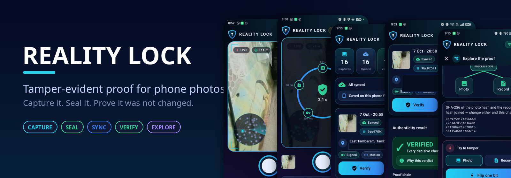

# Reality Lock

**Tamper-evident event proof for mobile devices.**<br>
Capture a real-world moment, seal it with a hardware-backed key, and let anyone check later that it was **not altered**.


-8b5cf6)


</div>

> Course project — Mobile Application Development / Embedded Programming, Dept. of CSE.
> Team: **Rakesh S**, **Anbuchelvan Ganesan**.

## What it does, in 30 seconds

1. 📷 **Capture** — the app records a photo **plus** GPS, time and motion-sensor readings in one shot. There is no "import from gallery", so a pre-edited file can never be signed.
2. 🔐 **Seal** — in about a second it hashes everything (SHA-256 → Merkle root) and signs the root with a key that **never leaves the phone's secure hardware**.
3. 📡 **Sync** — works with no network; the signed package queues and uploads by itself when connectivity returns.
4. ✅ **Verify** — a backend re-computes every hash and signature (15 checks) and shows *which* checks passed — never a single made-up score.
5. 🧪 **Explore** — flip one bit of a photo in the app and watch the hash, the Merkle root and the signature all break.

## See it work

Real screenshots from the app running on a OnePlus CPH2591 (Android 15). Precise GPS coordinates are blacked out in these images.

<table>
<tr>
<td align="center" width="25%">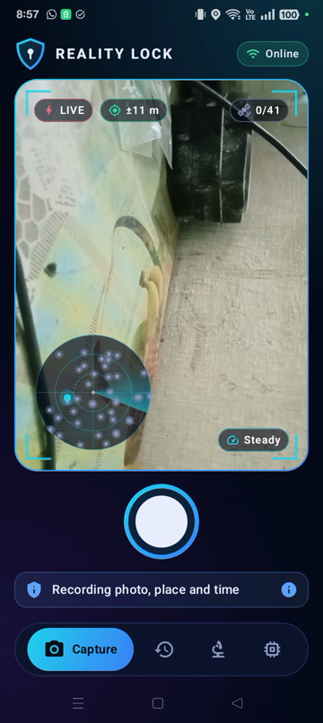<br><b>Live sensors</b><br><sub>real satellites, accuracy, tilt</sub></td>
<td align="center" width="25%">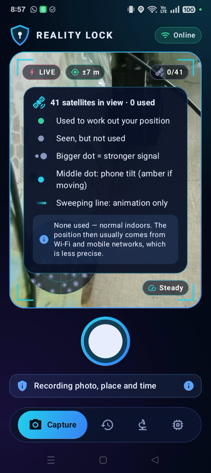<br><b>Reads itself out</b><br><sub>tap the radar for a legend</sub></td>
<td align="center" width="25%">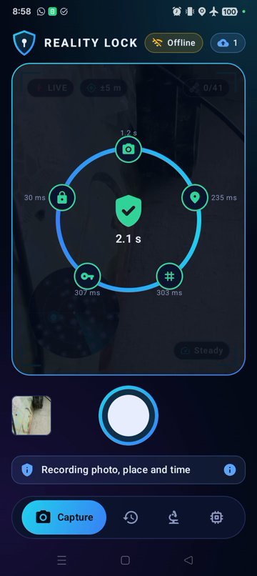<br><b>The seal</b><br><sub>every stage timed for real</sub></td>
<td align="center" width="25%">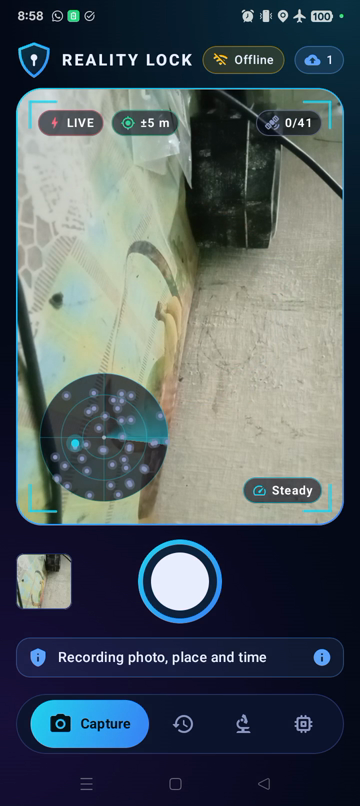<br><b>Offline-first</b><br><sub>airplane mode, queued (☁ 1)</sub></td>
</tr>
<tr>
<td align="center">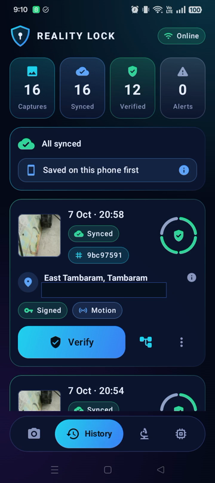<br><b>History</b><br><sub>trust ring per capture</sub></td>
<td align="center">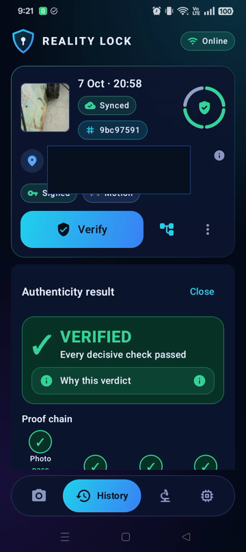<br><b>Verified</b><br><sub>15 checks, 4 groups</sub></td>
<td align="center">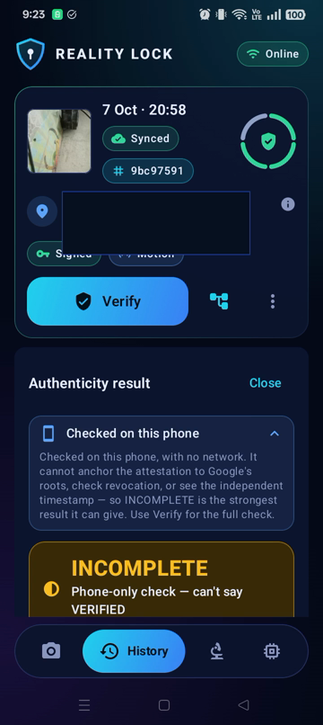<br><b>On-phone verify</b><br><sub>honestly says INCOMPLETE</sub></td>
<td align="center">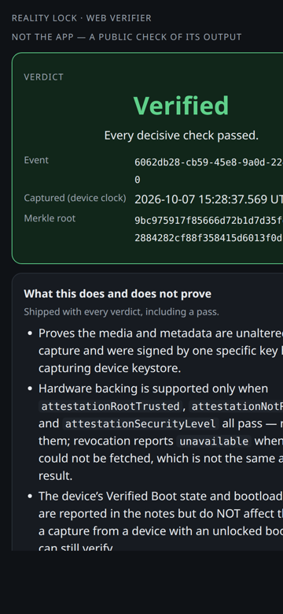<br><b>Public web verifier</b><br><sub>QR on the certificate opens it</sub></td>
</tr>
<tr>
<td align="center">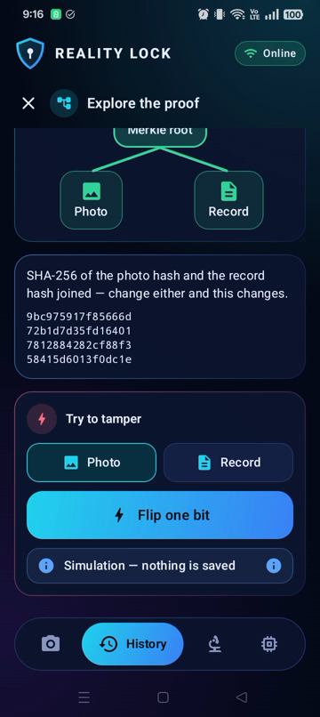<br><b>Proof explorer</b><br><sub>flip one bit, see it break</sub></td>
<td align="center">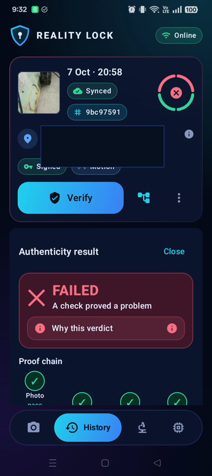<br><b>Real tamper test</b><br><sub>one digit edited → FAILED</sub></td>
<td align="center">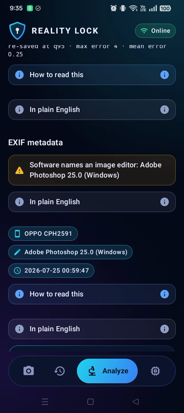<br><b>Forensic triage</b><br><sub>ELA + EXIF flags, never a verdict</sub></td>
<td align="center">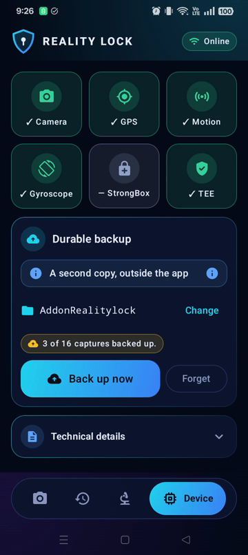<br><b>Device status</b><br><sub>capabilities + hardware key</sub></td>
</tr>
</table>

> **Walkthrough video.** A 34-second screen recording of the whole flow (airplane-mode capture → auto-sync → verify → tamper → restore → forensic triage) can be regenerated with [`scripts/demo/walkthrough/`](scripts/demo/walkthrough/). Every frame is the real app on a real phone; slowed or sped-up parts are labelled on screen.

## How it works

### System overview

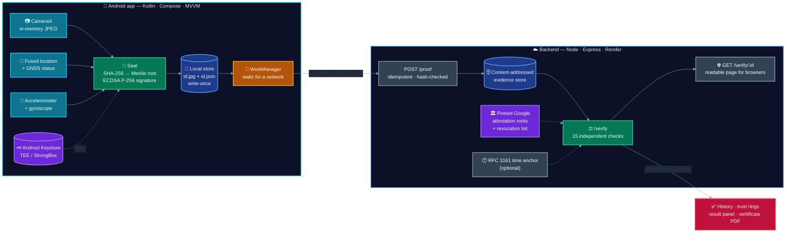

### The capture "seal" — five real stages

Each ring node lights up only when the pipeline *actually* reaches that stage, and shows how long it really took. A stage that never ran (no location permission) is shown as `skip`, never quietly ticked off.

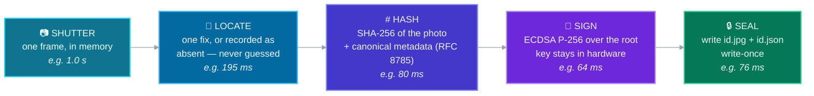

### Offline-first sync

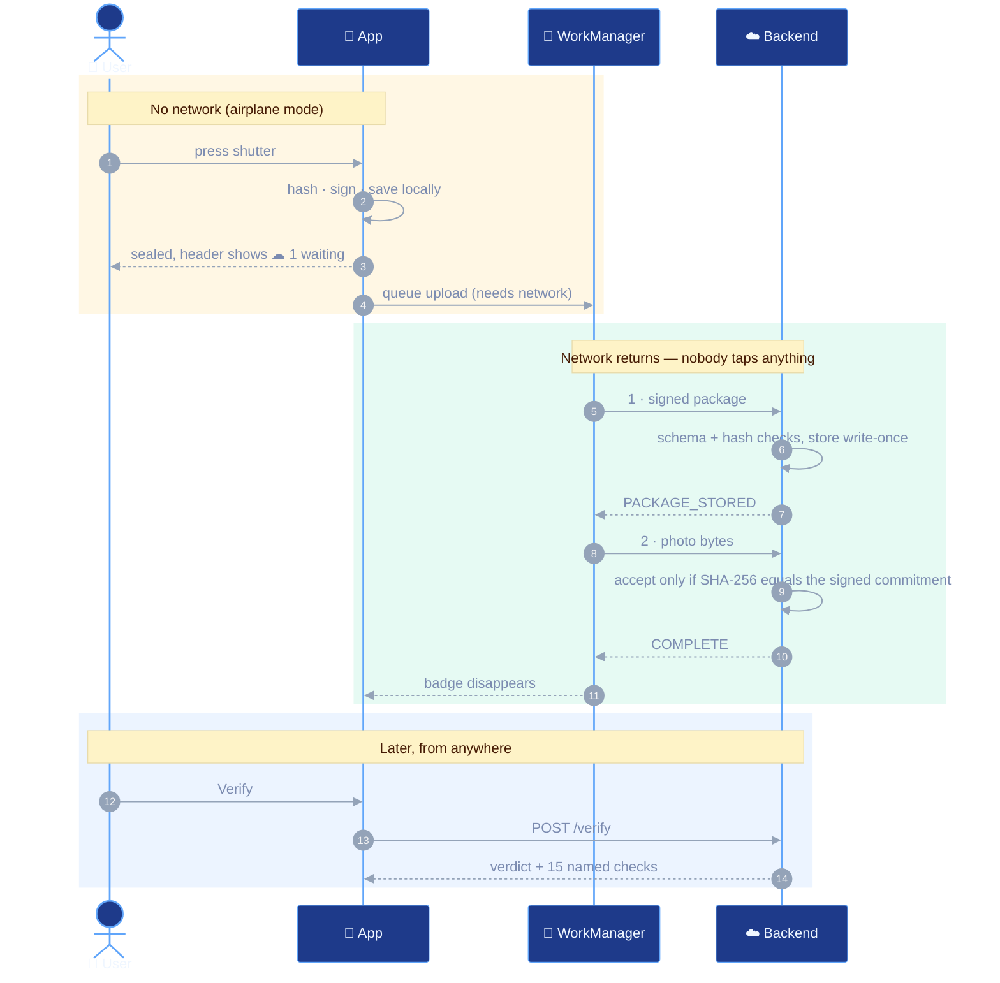

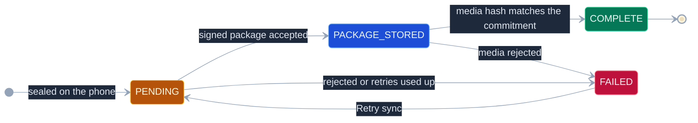

### What exactly is signed — the proof chain

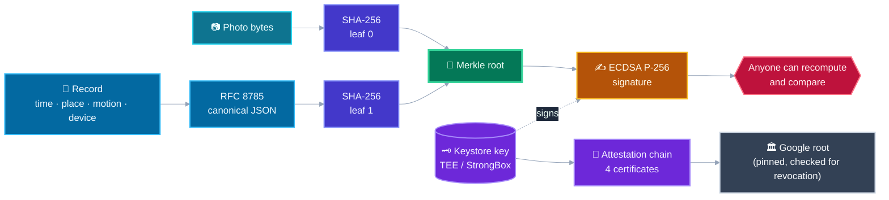

Change **one bit** of the photo and leaf 0 changes, so the root changes, so the signature no longer verifies. Change the record and the same happens through leaf 1. An attacker who rewrites the record *and* recomputes the hashes still fails, because the root is signed by a key they do not hold.

### 15 checks, 4 groups — and no single score

Each trust-ring arc takes the **worst** outcome in its group. A group with no result yet is an empty arc, not a pass.

```mermaid
%%{init: {'theme':'base','themeVariables':{'fontFamily':'Segoe UI, Inter, sans-serif','lineColor':'#94a3b8','textColor':'#e2e8f0','edgeLabelBackground':'#1e293b'}}}%%
flowchart TB
  subgraph G1["🧱 Integrity · 4"]
    direction TB
    a1["schemaValid"]:::chk
    a2["mediaHashMatch"]:::chk
    a3["metadataHashMatch"]:::chk
    a4["merkleRootMatch"]:::chk
  end
  subgraph G2["✍️ Signature · 1"]
    direction TB
    b1["signatureValid"]:::chk
  end
  subgraph G3["🛡️ Attestation · 6"]
    direction TB
    c1["attestationPresent"]:::chk
    c2["attestationChainValid"]:::chk
    c3["attestationKeyBinding"]:::chk
    c4["attestationRootTrusted"]:::chk
    c5["attestationNotRevoked"]:::chk
    c6["attestationSecurityLevel"]:::chk
  end
  subgraph G4["🕐 Context · 4"]
    direction TB
    d1["timestampPlausible"]:::chk
    d2["timestampAnchorValid *"]:::chk
    d3["captureTimeNotAfterAnchor *"]:::chk
    d4["locationPlausible"]:::chk
  end
  G1 --> RING(("🔘 Trust ring<br/>4 arcs"))
  G2 --> RING
  G3 --> RING
  G4 --> RING
  RING --> LEG["✓ pass · ✕ fail · — not checkable · ? unknown<br/>icon + colour + word, always"]:::leg
  classDef chk fill:#0f172a,stroke:#475569,color:#e2e8f0
  classDef leg fill:#1e293b,stroke:#94a3b8,color:#f8fafc
  style G1 fill:#083344,stroke:#22d3ee,color:#cffafe,stroke-width:2px
  style G2 fill:#064e3b,stroke:#34d399,color:#d1fae5,stroke-width:2px
  style G3 fill:#3b0764,stroke:#a78bfa,color:#ede9fe,stroke-width:2px
  style G4 fill:#451a03,stroke:#fbbf24,color:#fef3c7,stroke-width:2px
  style RING fill:#be123c,stroke:#fb7185,color:#fff1f2,stroke-width:2px
```

<sub>\* Only checkable when RFC 3161 time anchoring is enabled on the server (`TIMESTAMP_ANCHOR_ENABLED=true`); otherwise they read **not checkable** — which is *not* the same as pass or fail.</sub>

| Symbol | Meaning | Colour |
|---|---|---|
| ✓ **pass** | the check ran and held | green |
| ✕ **fail** | the check ran and broke — the verdict becomes **FAILED** | red |
| — **not checkable** | the evidence needed to run it is not there; never shown as pass or fail | grey |
| ? **unknown** | the verifier returned something this app version does not know | violet |

### Live demo flow

```mermaid
%%{init: {'theme':'base','themeVariables':{'fontFamily':'Segoe UI, Inter, sans-serif','lineColor':'#94a3b8','textColor':'#e2e8f0','edgeLabelBackground':'#1e293b'}}}%%
flowchart LR
  D0["🧰 demo_prep.sh<br/>URL · permissions · server awake"]:::prep --> D1["✈️ Airplane mode<br/>capture → ☁ 1 waiting"]:::cap
  D1 --> D2["📶 Reconnect<br/>uploads by itself"]:::sync
  D2 --> D3["✅ Verify<br/>VERIFIED · 15 checks"]:::ok
  D3 --> D4["🌳 Proof explorer<br/>flip a bit · everything breaks"]:::explore
  D4 --> D5["✏️ tamper.sh<br/>edit 1 digit of the record"]:::bad
  D5 --> D6["❌ Verify<br/>FAILED · Record link breaks"]:::bad
  D6 --> D7["↩️ tamper.sh --restore<br/>SHA-256 confirmed"]:::sync
  D7 --> D8["✅ Verify again<br/>VERIFIED"]:::ok
  classDef prep fill:#334155,stroke:#94a3b8,color:#f8fafc,stroke-width:2px
  classDef cap fill:#0e7490,stroke:#22d3ee,color:#ecfeff,stroke-width:2px
  classDef sync fill:#b45309,stroke:#fbbf24,color:#fffbeb,stroke-width:2px
  classDef ok fill:#047857,stroke:#34d399,color:#ecfdf5,stroke-width:2px
  classDef explore fill:#6d28d9,stroke:#a78bfa,color:#f5f3ff,stroke-width:2px
  classDef bad fill:#be123c,stroke:#fb7185,color:#fff1f2,stroke-width:2px
```

## Honest by design

This is an evidence app, so it is deliberately careful about what it claims.

- **No single "trust score".** Four independent groups, each in its own state.
- **`not checkable` is never `pass` or `fail`.** A device that cannot attest is not condemned; a missing time anchor is not a pass.
- **Verified means *unchanged since capture and signed by one hardware-backed key*.** It does **not** prove the event was real, unstaged or correctly described, and it is not a standalone legal certificate.
- **The phone's own check can never say VERIFIED** (see the screenshot above) — only the server, with the full chain, can.
- **Place names are display-only.** The readable place under the coordinates comes from a real geocoder (platform `Geocoder`, falling back to OpenStreetMap Nominatim with rounded coordinates). It is cached on the phone, never invented, never shown for a mock location, and is **not part of the signed record**.
- **The live radar is a live view, not evidence.** Satellites, tilt and accuracy are read from the phone's sensors while you frame the shot; only the single fix taken at the shutter is recorded.
- **The forensic *Analyze* tab is triage, not a verdict.** ELA and EXIF flags have innocent explanations; the experimental face classifier runs behind a face gate and carries no accuracy claim.

## Repository layout
| Path | What it is |
|---|---|
| [`android/`](android/) | Android app (Kotlin, MVVM, Compose): capture, hardware-backed signing, offline sync, on-device verification, proof explorer, forensic Analyze tab, evidence export and backup. Verified on a physical device. |
| [`backend/`](backend/) | Node.js + Express verification/storage service: full cryptographic `/verify`, Google-rooted attestation with revocation, RFC 3161 time anchoring, rate limiting, proof-of-possession reads. |
| [`docs/design/`](docs/design/) | The **Proof Package** schema + spec, example instance, and Architecture Decision Records. |
| [`docs/evidence/`](docs/evidence/) | Real proof sidecars pulled off a physical device, so the status claims below can be **checked, not trusted**. |
| [`docs/media/`](docs/media/) | The screenshots used in this README (coordinates blacked out). |
| [`scripts/demo/`](scripts/demo/) | Live-demo toolkit: readiness check, tamper/restore, and [`walkthrough/`](scripts/demo/walkthrough/) which records and cuts the walkthrough video from the real phone. |
| [`research/`](research/) | The full research corpus (competitive landscape, crypto architecture, tech stack, legal, literature) + the phased plan. **Start with [`research/README.md`](research/README.md).** |
| [`SETUP.md`](SETUP.md) | How to build/run each part + the manual cloud-account steps. |

## Project phases

```mermaid
%%{init: {'theme':'base','themeVariables':{'fontFamily':'Segoe UI, Inter, sans-serif','lineColor':'#94a3b8','textColor':'#e2e8f0','edgeLabelBackground':'#1e293b'}}}%%
flowchart LR
  P0["0 · Foundations<br/>code complete"]:::part --> P1["1 · Design<br/>proof package v1"]:::done
  P1 --> P2["2 · Capture<br/>CameraX · sensors · GPS"]:::done
  P2 --> P3["3 · Crypto core<br/>Merkle · ECDSA · attestation"]:::done
  P3 --> P4["4 · Integrity + forensics<br/>mock-location · ELA · EXIF"]:::done
  P4 --> P5["5 · Backend + sync<br/>offline-first · /verify"]:::done
  P5 --> P6["6 · Security validation<br/>rate limits · proof-of-possession"]:::done
  P6 --> P7["7-8 · Stretch + attestation<br/>RFC 3161 · annexure · bundle"]:::part
  P7 --> P9["9 · Cyber UI<br/>radar · seal · explorer · trust rings"]:::done
  classDef done fill:#047857,stroke:#34d399,color:#ecfdf5,stroke-width:2px
  classDef part fill:#b45309,stroke:#fbbf24,color:#fffbeb,stroke-width:2px
```

<sub>Green = complete against its own exit criteria; amber = partial **by design** (cloud accounts outstanding, accuracy characterisation in progress, stretch items refused or deferred with reasons). The details — including the defects found and fixed on a real device — are below.</sub>

<details>
<summary><b>Phase-by-phase status log</b> (click to expand)</summary>

> "Complete" below means **the phase's own exit criteria in
> [`research/09_PROJECT_PHASES.md`](research/09_PROJECT_PHASES.md) are met** — not
> merely that code exists. Where they are not met, this says so.

### Phase 0 (Foundations) — code complete; three cloud accounts outstanding
- Done: Android project + git, dependency baseline, backend, and **deployment
  plumbing solved** — [`render.yaml`](render.yaml) Blueprint and a root
  [`Dockerfile`](Dockerfile), both verified by building the image and serving
  `/health` and `/proof` from the running container.
- **Outstanding — needs account access, not code:** pressing *deploy* to get a
  public health-check URL; creating the **Firebase** project (Firestore/Storage/
  Auth); creating the **Play Console + GCP** entry that enables Play Integrity.
  Steps are in [`SETUP.md`](SETUP.md) §1.1, §3, §4. Only the last blocks work —
  it gates the Play Integrity task in Phase 3.

### Phase 1 (Design) — complete
- Android scaffold: version catalog (every version centralized — nothing hardcoded), layered config (`gradle.properties` → `local.properties` → typed `BuildConfig` → `AppConfig`), centralized `CryptoConfig`/`ProofPackageConstants`.
- Backend: env-driven config, `/health`, schema-validating `/proof`, per-check `/verify` — **smoke-tested live**.
- **Proof Package v1.0.0**: [schema](docs/design/proof-package.schema.json) + [spec](docs/design/PROOF_PACKAGE_SPEC.md), **machine-validated** (`cd backend && npm run validate:schema`).
- ADRs: [0001](docs/design/adr/ADR-0001-merkle-tree-leaves.md) (2-leaf now, 5-leaf designed-for), [0002](docs/design/adr/ADR-0002-timestamping-strategy.md) (OpenTimestamps-first).
- Built, installed and launched on a **OnePlus CPH2591 (Android 15)**.

### Phase 2 (Core Capture Pipeline) — complete, verified end-to-end on a physical device
- **CameraX capture** (in-memory, `CAPTURE_MODE_MINIMIZE_LATENCY`) — no gallery-import path exists by design, closing the "sign a pre-tampered file" hole.
- **Clock correlation** (`ClockCorrelator`) reconciling the monotonic capture instant with wall-clock time — **verified in production output**: `elapsedRealtimeNanos/1e6 + offset` reproduced the recorded `wallClockMillis` exactly.
- **Sensor binding** that selects the motion sample nearest the shutter (shared monotonic clock base) and **rejects samples beyond a 500 ms tolerance** rather than attaching misleading data.
- **Location** via `FusedLocationProviderClient.getCurrentLocation`, bounded by a timeout; when unavailable it is recorded as absent, never guessed.
- **JSON sidecar store** ([ADR-0003](docs/design/adr/ADR-0003-local-event-store.md)) — `<eventId>.jpg` + `<eventId>.json`, mirroring ProofMode's model.
- **Itemized permission consent** (camera required / location optional, separately explained) per the DPDP obligations in `research/06`.
- **48 unit tests passing**, including schema conformance validated against [the real schema file](docs/design/proof-package.schema.json) rather than a hand-copied field list.
- Verified on a **OnePlus CPH2591 (Android 15)** with a live GNSS fix — evidence in [`docs/evidence/`](docs/evidence/).

**Two real defects, both found by running the thing, both fixed:**

1. **Camera clock base** — captures were stamped **9.66 days in the past**. `SensorEvent.timestamp` uses `CLOCK_BOOTTIME`, but this device's camera declares `SENSOR_INFO_TIMESTAMP_SOURCE = UNKNOWN` (`CLOCK_MONOTONIC`), which pauses during deep sleep. The timestamp source is now queried per camera and normalised. After the fix the recorded instant sits **0.24 s** from the shutter, and motion — which had never once populated on this device — now binds **1.49 ms** from the capture. See [`docs/evidence/`](docs/evidence/).
2. **Producer/schema divergence** — the serializer emitted three shapes the shared schema rejects (a `mediaFilePath` the schema forbids, `location: null` against a non-nullable field, `gyroscope: []` against `minItems: 3`). The test that claimed to guard this only checked key presence and never loaded the schema, so it passed throughout.

**Motion skew tolerance** (added earlier, when samples were binding 4595 ms from the shutter) is what kept defect 1 from silently producing plausible-looking motion data: it rejected the mismatched samples and recorded `null` instead.

**Not yet verified:** behaviour on a device whose camera reports `TIMESTAMP_SOURCE_REALTIME` — that branch is unit-tested but has not run on such hardware.

### Phase 3 (Cryptographic Core) — complete, verified on a physical device
- **Every capture is now a fully-formed, signed proof package**: SHA-256 media leaf (streamed) → RFC 8785 canonical metadata leaf → 2-leaf Merkle root → ECDSA P-256 signature from a key generated inside the Android Keystore.
- **Hardware key attestation, not Play Integrity** ([ADR-0004](docs/design/adr/ADR-0004-attestation-strategy.md)) — a deliberate deviation from `research/08` #16 that costs **$0** instead of $25 and certifies the claim the package actually makes. Proven on the device: `tier=TRUSTED_ENVIRONMENT`, 4-certificate chain whose root SHA-256 **exactly matches** one published at `android.googleapis.com/attestation/root`.
- **Backend `/verify` performs real cryptography**: media leaf, metadata leaf, Merkle root, ECDSA signature, attestation chain linkage, and `attestationKeyBinding` — the check that the attested key *is* the signing key, without which a genuine chain could be stapled onto someone else's package.
- **74 tests** (63 Android + 11 backend), including a **cross-implementation Merkle vector** asserted identically in Kotlin and Node so the two can never silently drift.

**Tamper detection, demonstrated end-to-end:**
```
1. GENUINE package + genuine media   → all crypto checks pass
2. ONE BIT flipped in the JPEG       → verdict failed, mediaHashMatch fail
3. Latitude altered in metadata      → verdict failed, metadataHashMatch fail
4. Media not supplied                → mediaHashMatch unavailable (never "pass")
```
A backend test also covers the subtle case: an attacker who edits metadata **and** recomputes the leaf and root so the tree is internally consistent still fails `signatureValid` — which is exactly why the root is signed.

**Honest limits:** the verdict is `incomplete`, never `verified`, while `timestampPlausible`/`locationPlausible` remain Phase 4/5 — a passing package is not allowed to overclaim. Motion binding is usually 1–4 ms from the shutter but **intermittently reaches ~270–490 ms**; the 500 ms guard keeps it truthful and the exact offset travels in the package. Key attestation also does not prove the *running app* is unmodified, unlike Play Integrity's device-integrity verdict.

### Phase 4 (Location Integrity + Explainable Authenticity Heuristic) — complete, verified on device
- **Location integrity** ([ADR-0005](docs/design/adr/ADR-0005-phase4-integrity-and-forensics-scope.md)): `isMock()` plus a speed/distance "teleportation" check (Haversine, **>1500 km/h** with jitter guards — the plan's 300 km/h would have falsely flagged ordinary air travel). Written to the proof package's advisory `integrity.location` block.
- **The mock 4-check pattern was *not* built** — research showed 3 of its 4 checks are dead code for a normal app on API 35 (the AppOps scan needs a privileged permission; the `Settings.Secure` flag has read 0 since API 23). Shipping non-functional code as a security feature would be dishonest.
- **GNSS raw** is a capability probe only (surfaced on the Device screen); C/N0-AGC spoofing analysis is honestly scoped as future work.
- **Explainable Authenticity Heuristic** — a separate **Analyze** tab: pick any candidate image → ELA heat-map + EXIF-consistency flags. It produces a *report*, never a proof package, and never signs or stores anything, so the "no gallery import into the proof flow" rule stays intact.
- **Labelled as triage, never a verdict** — the screen leads with a disclaimer and attaches no real/fake score, because ELA is well-documented as unreliable if overclaimed (Farid: it mislabels real and altered images "with the same likelihood").

**Exit criteria proven on the physical CPH2591** via 3 instrumented tests (the project's first `androidTest`), using the real Android JPEG encoder and `androidx.exifinterface`:
```
PASS  ela_highlights_the_spliced_region        (spliced seam > 1.5× background)
PASS  exif_flags_an_image_edited_in_photoshop  (EDITOR_SOFTWARE fires)
PASS  ela_analyzer_produces_a_heatmap_of_matching_size
```
Evidence — including the ELA heat-map lighting up a known splice — in [docs/evidence/phase4-forensics/](docs/evidence/phase4-forensics/). **86 unit tests + 3 instrumented.**

### Phase 5 (Backend, Storage & Verification Module) — complete, verified on device
- **Offline-first sync**: capture with no connectivity and the upload waits on a
  `CONNECTED`-constrained WorkManager job, then runs **by itself** when a network
  returns. Two steps — the small package first, then the media — so a capture
  stranded between them is a distinguishable state, not a mystery.
- **The signed package file is now provably write-once.** Sync state is mutable, so
  it lives in a *separate* `sync/<eventId>.json`; the captures directory holds
  nothing but immutable evidence ([ADR-0006](docs/design/adr/ADR-0006-phase5-sync-storage-and-verification.md) §3).
- **Evidence is forwarded, never re-encoded.** The app ships the exact stored bytes
  over plain OkHttp — no Retrofit, no Gson model. Re-serializing a signed document
  could change number formatting or escaping and break the metadata hash, and the
  failure would be indistinguishable from tampering. A unit test asserts the bytes
  on the wire equal the bytes on disk.
- **Immutable, content-addressed storage**: `POST /proof` is idempotent for a
  byte-identical retry and `409` for a rewrite; media is accepted **only if it
  hashes to the digest the signed package commits to**, so the store cannot be made
  to hold media no valid package vouches for.
- **All five verification checks now implemented.** `timestampPlausible` checks the
  producer's *exact* derivation identity (`wallClockMillis == elapsed/1e6 + offset`),
  the ISO-8601 rendering, and that nothing was captured in the future.
  `locationPlausible` recomputes implied speed against the previous stored capture
  from the same install — which is why it needed the store.
- **Authenticity Result UI** with the per-check breakdown, non-blocking
  **advisories**, and the limitations block rendered *even on a pass*.
- **PDF certificate** via Android's own `PdfDocument` + a zxing QR badge, with the
  "what this does not prove" framing boxed at the **top**, before any hash or
  verdict — and enforced in the constructor, so a certificate without its caveats
  cannot be built.

**Two findings worth recording:**
1. **Firebase Cloud Storage stopped being free** — since 2026-02-03 it requires a
   linked billing account. Firestore is still free on Spark with no card. So media
   goes to our content-addressed store instead, which costs nothing evidentiary:
   **the package binds media by hash, not by location.** Phase 5 remains $0, no card.
2. **`unavailable` must not read as `fail`.** A missing attestation chain used to
   report `fail`, which wrongly condemned every package from a device that cannot
   attest. It is now `unavailable` plus an advisory, and the verdict rules are
   pinned in ADR-0006 §5.

**Exit criteria proven on the physical CPH2591** by [`scripts/e2e/run_sync_e2e.sh`](scripts/e2e/run_sync_e2e.sh),
which drives a real capture in **airplane mode** against a real backend over
`adb reverse`. **141 unit tests + 6 instrumented + 68 backend.**

**Not built at the time (stated, not hidden):** no authentication or rate
limiting on the backend. Both were closed in Phase 6 — see below.

### Phase 6 (Testing, security validation, deployment) — complete; two accuracy items in progress
Full record: [`docs/design/PHASE6_SECURITY_VALIDATION.md`](docs/design/PHASE6_SECURITY_VALIDATION.md).
- Each security scenario (media tamper, metadata tamper, mock location, gallery
  import, weak/absent attestation) was run and its result recorded, including the
  one that had to be rewritten because Play Integrity is not used (ADR-0004).
- Per-IP rate limiting with a verified `trust proxy` hop count, R8 minification,
  and **proof-of-possession on reads** ([ADR-0007](docs/design/adr/ADR-0007-backend-read-authorisation.md)):
  only the key that signed a package can fetch its GPS or photo back.
- Deployed at `https://civicmesh.onrender.com/` (Render free tier — ~20–60 s cold
  start after 15 min idle; the store is wiped by every redeploy).
- **In progress:** GPS accuracy and ELA false-positive characterisation — the
  physical data is being collected. No accuracy figure is claimed until then.

### Phase 7 (Stretch) and Phase 8 (Attestation hardening) — partial, by design
Full record: [`docs/design/PHASE7_STRETCH_STATUS.md`](docs/design/PHASE7_STRETCH_STATUS.md).
- **Built:** BSA 2023 s.63 annexure (PDF), bystander capture notice, RFC 3161 time
  anchoring with an ordered fallback of three TSAs ([ADR-0009](docs/design/adr/ADR-0009-independent-time-anchor.md)),
  evidence-bundle export, durable SAF backup, and an **experimental** Meso-4
  deepfake classifier behind a face gate with no accuracy claim ([ADR-0010](docs/design/adr/ADR-0010-experimental-deepfake-classifier.md)).
- **Attestation:** the chain is anchored to Google's **pinned** roots (re-checked
  byte-for-byte against the live list on 2026-09-21), checked against Google's
  revocation list, and its extension parsed for the security level.
- **Refused or declined with reasons:** OpenTimestamps (unfixable CVEs), face blur,
  Wi-Fi/cell cross-check. **Not built:** PRNU, C2PA export, Polygon anchoring.

Test inventory: **364 Android JVM tests** (run 2026-10-07, 0 failures), **178 backend tests** (last run
2026-09-21; the backend has not changed since), plus **34 instrumented** `@Test` methods and one
manual on-device test for the address lookup.

### Phase 9 (Cyber UI and live showpieces, October 2026) — complete, verified on device
- **Always-dark cyber look**, an adaptive launcher icon and a drawn-on splash. Long caveats became icon chips with the **full text one tap away** — shortened, never deleted.
- **Live sensor radar** on the viewfinder: real GNSS satellites (used vs only seen), reported accuracy and a tilt bubble. It is a live view only; the legend says so, and nothing from it is saved.
- **Capture "seal" animation** driven by the real pipeline: shutter, locate, hash, sign, seal, each with its measured duration; a skipped stage reads `skip`.
- **Trust rings** on History: four arcs (Integrity, Signature, Attestation, Context), each the worst outcome of its group — never one score.
- **Proof explorer** with a tamper simulator that flips one bit in an in-memory copy and re-runs the real SHA-256 and ECDSA checks. Nothing is written.
- **Place names beside coordinates** from a real geocoder, display-only and never signed; verified against independent Plus Codes and an on-device test (see *Honest by design*).
- Found and fixed while recording the walkthrough: the header's Online/Offline pill could stay "Online" through airplane mode (it now reads the network callback's own capabilities and requires a validated connection), and a verdict opened below the fold with nothing scrolling it into view (History now scrolls to the card the result belongs to). **364 JVM tests pass.**

</details>

## Live demo toolkit
- **`scripts/demo/demo_prep.sh [--resync-missing]`** — run before any demo with the
  phone on USB. It checks the backend URL the *installed* APK actually uses (read out
  of the APK itself), wakes the server, checks permissions and the battery exemption,
  and finds captures the server lost in a redeploy. `--resync-missing` re-queues them
  so the app uploads the original signed bytes again — nothing is re-signed.
- **`scripts/demo/tamper.sh [eventId] | --restore`** — edits one digit of a synced
  capture's stored record on the phone, so the next Verify shows the Record link fail
  in the proof-chain diagram; `--restore` puts the original bytes back and confirms
  them by SHA-256. It refuses to touch anything not yet synced, because the server
  store is append-only.
- **The certificate's QR code opens a readable page.** `GET /verify/:eventId` returns
  HTML to a browser and unchanged JSON to everything else. The page is labelled as
  the web verifier, needs no JavaScript, and never shows the photo or the location.
- **Verify on this phone (no network)** in a capture's ⋮ menu runs the on-device
  verifier. It is labelled as such, and it can never say VERIFIED (see
  `OfflineProofVerifier`).

## Quick start
```bash
# Backend (fully runnable now)
cd backend && npm install && npm run validate:schema && npm run dev

# Android
# Open the android/ folder in Android Studio and let it sync (see SETUP.md).
```

## End-to-end test
One command drives the whole system — unit tests, schema, a live backend, real
captures on an attached phone, then the pulled sidecars back through the
backend's `/proof` and `/verify`:
```bash
./scripts/e2e/run_e2e.sh 3        # 3 captures
SKIP_DEVICE=1 ./scripts/e2e/run_e2e.sh   # no phone attached
```
It discovers the package name, a free port and the shutter button at run time —
nothing about the environment is hardcoded — and checks each capture against
both the shared schema **and** Phase 2's exit criteria (a document where every
optional field is null would still be schema-valid, so validity alone is not
enough). Last run on a OnePlus CPH2591: **11 passed, 0 failed**, motion bound
0.76 / 1.27 / 4.49 ms from the shutter.

### Phase 5: offline sync, storage and verification
```bash
./scripts/e2e/run_sync_e2e.sh
```
Puts the **real phone into airplane mode**, captures, proves nothing reached the
server, restores connectivity and then **taps nothing** — the queued upload has
to fire by itself. Then checks immutability, hash-enforced media, all five
verification checks, tamper detection, and that the public QR endpoint leaks no
GPS. The phone reaches the laptop over `adb reverse`, so a USB cable is the only
networking required, and the device is left exactly as it was found. Last run on
a OnePlus CPH2591: **33 passed, 0 failed**; the queued capture synced 4 s after
connectivity returned. Details in
[docs/evidence/phase5-sync-verification/](docs/evidence/phase5-sync-verification/).

## What this proves (and does not)
A passing proof package certifies the media+metadata bundle is **unaltered since capture and signed by a specific hardware-backed key**. It does **not** prove the depicted event was real/unstaged, and is **not** a standalone legal certificate. This honesty is by design — see [`docs/design/PROOF_PACKAGE_SPEC.md`](docs/design/PROOF_PACKAGE_SPEC.md) and `research/06_legal_standards_compliance.md` §7.
