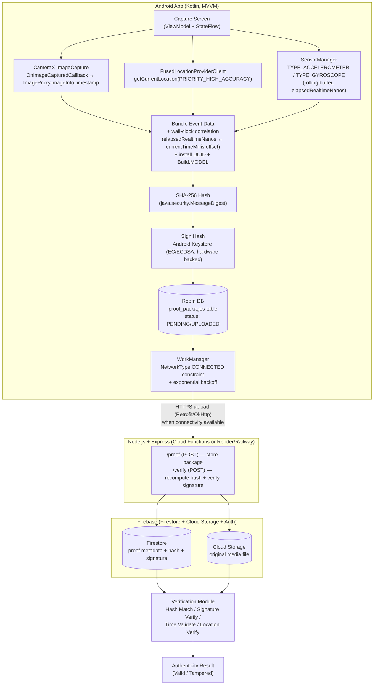

# Mobile Tech Stack Research — Reality Lock (Android Client)

**Scope:** Concrete, buildable technology decisions for the Android app half of Reality Lock (capture → hash → sign → queue → upload) and the backend/storage it talks to. Written for a 2-person student team on a semester timeline, free-tier tooling only. Every recommendation below is decisive — pick the first option unless a specific reason is given to deviate.

---

## 1. Android App Architecture — MVVM (with Jetpack ViewModel + Flow), not MVI

**Recommendation: MVVM**, using `ViewModel` + Kotlin `StateFlow`/`SharedFlow` (Flow instead of `LiveData`, since `LiveData` is lifecycle-bound and awkward for the sensor/network streams this app needs), organized in a light three-layer split: **UI (Activity/Fragment/Compose) → ViewModel → Repository (Room + WorkManager + network + Keystore crypto)**.

**Why MVVM over MVI for this specific app:**

- The app's hard problems (camera timing, sensor snapshotting, crypto, background sync) live in the **data/domain layer**, not in complex UI state transitions. MVI's main payoff — a single immutable `State` object eliminating UI state-sync bugs — matters most when the *UI* has many interdependent visual states (feeds, filters, multi-step wizards). Reality Lock's UI is comparatively simple (a capture screen, a queue/history list, a verification screen), so MVI's extra ceremony (Intent sealed classes, reducers, single state object per screen) buys little here.
- MVVM is directly supported by Android Jetpack out of the box (`ViewModel`, `viewModelScope`, `SavedStateHandle`) with no extra architecture library, which matters for a 2-person team on a semester clock — less boilerplate to teach/debug.
- Background sensor logging, camera capture, and crypto/network operations are naturally modeled as **suspend functions / Flows exposed by a Repository**, which the ViewModel collects and exposes to the UI as `StateFlow`. This fits MVVM's "ViewModel exposes observable state, UI observes it" model directly — you don't need MVI's Intent layer to get unidirectional data flow; `StateFlow` already gives you that.
- If, once the project is underway, the capture screen turns out to need many co-dependent states (e.g., "gps-acquiring / sensors-warming / camera-ready / all-locked / capturing / signing / done" as one atomic state machine), it is reasonable to apply an **MVI-style sealed-class `UiState`/`UiEvent` pattern *inside* that one ViewModel only** — this is not a contradiction of "MVVM overall," it's the common real-world hybrid (cited as Netflix's approach: MVVM app-wide, MVI locally for the one complex screen).

**Sources:** [MVVM vs MVI vs Redux for Android in 2025 (Medium)](https://medium.com/@androidlab/mvvm-vs-mvi-vs-redux-for-android-in-2025-which-architecture-should-you-choose-850a0566e30b), [Best Android Architecture 2025 (Medium)](https://medium.com/@sixtinbydizora/android-architecture-wars-mvi-vs-mvvm-vs-uni-directional-flow-in-2025-265d565a293d), [Android Developers — Guide to app architecture](https://developer.android.com/topic/architecture)

---

## 2. Camera Capture — CameraX, not raw Camera2

**Recommendation: `androidx.camera` (CameraX)**, specifically the `ImageCapture` use case, **not** direct Camera2.

**Why CameraX wins for tamper-evident capture specifically:**

- The core requirement here is not "manual camera control" (manual exposure/RAW/burst-mode tuning) — it's **reliability across devices with minimal code**, since two students cannot realistically write and test per-OEM Camera2 device-compatibility workarounds. CameraX is built directly on top of Camera2 and Google states its own benchmarks show **<5% performance difference vs. raw Camera2**, while handling device-specific quirks CameraX already solved for ~98% of devices running Android 5.0+. That trade is exactly right for a semester project.
- Camera2 is only the better choice when you need fine-grained manual sensor control (manual ISO/exposure, RAW capture pipelines, custom capture-request chaining) — none of which "tamper-evident capture" requires. What tamper-evidence *does* require — a reliable, precisely-timestamped capture event you can correlate with GPS/sensors — CameraX already exposes.
- **Concrete API surface to use:**
  - `ImageCapture.Builder().setCaptureMode(ImageCapture.CAPTURE_MODE_MINIMIZE_LATENCY).build()` — minimizes shutter-to-callback latency, which is what keeps the GPS/sensor snapshot time-correlated with the actual shutter moment.
  - For the tamper-evident flow, prefer the **in-memory capture path**, not the file-saving path, because it gives you the frame *and* its exact capture timestamp before anything touches disk:
    ```kotlin
    imageCapture.takePicture(
        cameraExecutor,
        object : ImageCapture.OnImageCapturedCallback() {
            override fun onCaptureSuccess(image: ImageProxy) {
                val captureTimestampNanos = image.imageInfo.timestamp // elapsedRealtimeNanos-based clock
                // 1. Convert captureTimestampNanos -> wall clock (see §4)
                // 2. Snapshot last GPS fix + last sensor readings using that same timestamp
                // 3. Hash the JPEG bytes + bundle, THEN sign
                image.close()
            }
            override fun onError(exception: ImageCaptureException) { /* handle */ }
        }
    )
    ```
    - `ImageProxy.getImageInfo()` → `ImageInfo` → `ImageInfo.getTimestamp()` gives the **actual sensor capture timestamp** (same clock base as `SystemClock.elapsedRealtimeNanos()`), which is far more precise for correlation than "the wall-clock time your callback happened to run," since callback dispatch can lag the real shutter moment by tens of milliseconds.
  - If you need a saved JPEG file too (for upload), use the second overload: `imageCapture.takePicture(outputFileOptions: ImageCapture.OutputFileOptions, executor, ImageCapture.OnImageSavedCallback)` — but derive your canonical capture timestamp from the `OnImageCapturedCallback`/`ImageProxy` path, or from `ImageInfo.getTimestamp()` if using `ImageCapture.OnImageSavedCallback`'s associated proxy, not from `System.currentTimeMillis()` called inside the callback.
  - `ImageCapture.CAPTURE_MODE_MINIMIZE_LATENCY` vs `CAPTURE_MODE_MAXIMIZE_QUALITY`: use `MINIMIZE_LATENCY` — tamper-evidence cares about tight time correlation more than JPEG quality tuning.

**Gradle version (current stable, mid-2026):** `androidx.camera:camera-core:1.6.1`, `camera-camera2:1.6.1`, `camera-lifecycle:1.6.1`, `camera-view:1.6.1` (a `1.7.0-alpha02` exists but stick to stable for a graded project).

**Sources:** [CameraX architecture — Android Developers](https://developer.android.com/media/camera/camerax/architecture), [Capture an image — Android Developers](https://developer.android.com/media/camera/camerax/take-photo), [Choose a camera library — Android Developers](https://developer.android.com/media/camera/choose-camera-library), [CameraX 1.5 announcement — Android Developers Blog](https://android-developers.googleblog.com/2025/11/introducing-camerax-15-powerful-video.html), [Camera2 vs CameraX comparison — Medium](https://medium.com/@seungbae2/camera2-vs-camerax-a-comparison-of-android-camera-apis-5db2b5ff302e)

---

## 3. Location — FusedLocationProviderClient with `getCurrentLocation()`, not raw `LocationManager`

**Recommendation:** `com.google.android.gms.location.FusedLocationProviderClient`, calling **`getCurrentLocation(Priority.PRIORITY_HIGH_ACCURACY, cancellationToken)`** at the moment of capture — not `requestLocationUpdates()`, and not the plain platform `android.location.LocationManager`.

**Why Fused over raw LocationManager:** FusedLocationProviderClient blends GPS, Wi-Fi, cell, and sensor data via Google Play Services to give better accuracy and faster fixes with less battery drain than manually polling `LocationManager`'s individual providers (`GPS_PROVIDER`, `NETWORK_PROVIDER`) and picking the best one yourself — which is exactly the kind of device-fragmentation problem a 2-person team should not be reinventing. Google explicitly recommends Fused Location over LocationManager for new apps.

**Why `getCurrentLocation()` over `requestLocationUpdates()` for this use case:** Reality Lock needs exactly **one accurate fix at the instant of capture**, not a continuous stream. `getCurrentLocation()` is purpose-built for that: it returns a single fresh fix (computing one if no sufficiently recent cached fix exists), self-manages the request lifecycle, and is explicitly documented as "the recommended way to get a fresh location... safer than alternatives like starting and managing location updates yourself using `requestLocationUpdates()`." Using `requestLocationUpdates()` for a one-shot fix means you must manually start/stop the stream yourself and risk leaking a live location subscription (battery drain) if you forget to remove the callback — an easy bug for students to introduce.

**Concrete pattern for the capture moment:**
```kotlin
val fusedClient = LocationServices.getFusedLocationProviderClient(context)
val cancellationTokenSource = CancellationTokenSource()

fusedClient.getCurrentLocation(Priority.PRIORITY_HIGH_ACCURACY, cancellationTokenSource.token)
    .addOnSuccessListener { location: Location? ->
        // location.latitude, location.longitude, location.accuracy, location.time (wall-clock epoch ms)
    }
```
Practical tip for the capture pipeline: **kick off `getCurrentLocation()` a second or two *before* the user presses the shutter** (e.g., as soon as the capture screen opens) and keep it "warm," rather than starting it exactly at shutter-press — a fresh GPS fix can take 1–5+ seconds outdoors and longer indoors, and you do not want the shutter to visibly hang. Bundle the most recent fix into the proof package and record how many milliseconds old it was relative to the image capture timestamp.

**Sources:** [Get the last known location — Android Developers](https://developer.android.com/develop/sensors-and-location/location/retrieve-current), [FusedLocationProviderClient — Google for Developers](https://developers.google.com/android/reference/com/google/android/gms/location/FusedLocationProviderClient), [Migrate to Google Play services location APIs — Android Developers](https://developer.android.com/develop/sensors-and-location/location/migration)

---

## 4. Motion Sensors — SensorManager, and the wall-clock correlation problem (important, easy to get wrong)

**Recommendation:** Use `SensorManager` with `Sensor.TYPE_ACCELEROMETER` (raw, includes gravity), `Sensor.TYPE_GYROSCOPE` (angular rate), and optionally `Sensor.TYPE_LINEAR_ACCELERATION` (software-fused, gravity removed) — register listeners **before** the capture screen is shown (e.g., `SENSOR_DELAY_GAME`, ~20 ms interval) and keep a small rolling buffer of the most recent readings, rather than trying to register-and-read synchronously at the exact instant of the shutter (sensors are asynchronous/event-driven, there is no "read now" call).

```kotlin
val sensorManager = context.getSystemService(Context.SENSOR_SERVICE) as SensorManager
val accel = sensorManager.getDefaultSensor(Sensor.TYPE_ACCELEROMETER)
val gyro  = sensorManager.getDefaultSensor(Sensor.TYPE_GYROSCOPE)
sensorManager.registerListener(listener, accel, SensorManager.SENSOR_DELAY_GAME)
sensorManager.registerListener(listener, gyro,  SensorManager.SENSOR_DELAY_GAME)
```
At capture time, snapshot the **last received `SensorEvent`** for each sensor type from your rolling buffer (or average the last N ms) and bundle those values plus their timestamps into the proof package.

**The critical detail — sensor timestamps are NOT wall-clock, image timestamps are NOT wall-clock either:**

- `SensorEvent.timestamp` and `ImageInfo.getTimestamp()` (from CameraX) both use the **same clock base**: nanoseconds since boot, per the same convention as `SystemClock.elapsedRealtimeNanos()`. This clock is monotonic and — critically — **continues ticking through deep sleep**, unlike `SystemClock.uptimeMillis()` which pauses in deep sleep. That shared basis is actually good news: it means sensor timestamps and the CameraX capture timestamp are **already directly comparable to each other** without any conversion, since both use `elapsedRealtimeNanos()`.
- What is **not** directly comparable is `System.currentTimeMillis()` (wall clock / "real" calendar time — what you actually want to put in a human-readable, legally-meaningful proof certificate). Wall clock can jump backward or forward at any time (user changes the date, NTP sync, timezone change), so you cannot just record `System.currentTimeMillis()` separately at each event and assume it lines up with the sensor/camera timestamps.
- **Correct correlation approach:** at the moment you snapshot everything for the proof package, take one simultaneous pair of readings — `val bootNow = SystemClock.elapsedRealtimeNanos()` and `val wallNow = System.currentTimeMillis()` — and compute the **offset** `wallNow - (bootNow / 1_000_000)`. Then for any event with an `elapsedRealtimeNanos`-based timestamp `t` (sensor event, image capture), its wall-clock time is `t/1_000_000 + offset`. Concretely:
  ```kotlin
  val offsetMs = System.currentTimeMillis() - (SystemClock.elapsedRealtimeNanos() / 1_000_000L)
  fun toWallClockMillis(elapsedRealtimeNanosTimestamp: Long): Long =
      elapsedRealtimeNanosTimestamp / 1_000_000L + offsetMs
  ```
  Recompute this offset at (or very close to) capture time — don't cache it for long, since wall clock can be adjusted mid-session. Store **both** the raw `elapsedRealtimeNanos` values (for internal consistency/monotonic proof of ordering) **and** the derived wall-clock timestamp (for human/legal readability) in the proof package, plus the GPS fix's own `Location.getTime()` (already wall-clock epoch millis from Play Services) as a cross-check against your derived wall clock — a large mismatch between the phone's derived wall clock and the GPS-supplied UTC time is itself a useful tamper/clock-manipulation signal worth flagging in the proof package.

**Sources:** [Motion sensors overview — Android Developers](https://developer.android.com/develop/sensors-and-location/sensors/sensors_motion), [SensorEvent.Timestamp — Microsoft Learn / AOSP docs](https://learn.microsoft.com/en-us/dotnet/api/android.hardware.sensorevent.timestamp?view=net-android-34.0), [SystemClock — AOSP reference (archived)](https://webarchive.library.unt.edu/web/20160706141220mp_/https://developer.android.com/reference/android/os/SystemClock.html)

---

## 5. Device Identity/Info — locally-generated install UUID as primary, `ANDROID_ID` as secondary signal, never IMEI

**Recommendation:** Generate and persist **your own UUID at first app launch** (`UUID.randomUUID().toString()`, stored in app-private storage / `DataStore`) as the primary "device/installation identity" field in the proof package. Optionally also record `Settings.Secure.ANDROID_ID` as a secondary, best-effort device signal. **Do not use IMEI.**

**Why, concretely:**
- **IMEI is off the table categorically**, not just "discouraged": reading it requires the privileged `READ_PRIVILEGED_PHONE_STATE` permission, which third-party Play Store apps **cannot** hold — regular apps have had no way to read IMEI since Android 10. There is no path to legitimately using IMEI here even if you wanted to.
- `Settings.Secure.ANDROID_ID` is readable without special permission and is stable per (app signing key, device, user) combination — but Google's own official identifier guidance now flags it as a device-scoped, **non-resettable** identifier (it survives app reinstalls, only changing on factory reset), which makes it a heavier privacy commitment than the use case needs, and Google's own developer guidance nudges apps toward more privacy-respecting, app-scoped alternatives for non-advertising use cases like this. It is fine to *log* `ANDROID_ID` as one extra field for cross-referencing multiple submissions from the same physical device, but it should not be the sole/primary identity, and if collected it must be declared in the Play Console Data Safety form as a "Device or other ID."
- A **locally-generated install UUID** (or Firebase Installation ID if you end up using Firebase — see §7) is the officially recommended pattern for "identify this app installation" use cases: it's app-scoped (can't be used to track the user across other apps), naturally resets on reinstall/uninstall (privacy-friendly), requires no permission, and is entirely sufficient for a proof package's purpose — proving "this install submitted this event," not "this physical hardware unit."
- Also bundle in the proof package (all freely available, no privacy sensitivity): `Build.MODEL`, `Build.MANUFACTURER`, `Build.VERSION.SDK_INT`, and your own app `versionName`/`versionCode` — useful forensic/debug metadata that doesn't raise privacy flags.

**Sources:** [Best practices for unique identifiers — Android Developers](https://developer.android.com/identity/user-data-ids), [What is Android ID? — Hexnode](https://www.hexnode.com/blogs/what-is-android-id/), [Play Console policy announcement, 10 April 2025](https://support.google.com/googleplay/android-developer/answer/15899442?hl=en-GB)

---

## 6. Backend — Node.js/Express recommended over Python/FastAPI (for this team), with FastAPI as a legitimate second choice

**Recommendation: Node.js + Express**, primarily because it keeps the team in **one language (JavaScript/TypeScript)** across the eventual web verification portal and API, and because Node's built-in `crypto` module already covers everything the verification service needs (SHA-256 hashing, ECDSA/Ed25519 signature verification) with zero extra dependency to learn.

**The comparison, concretely:**

| | Node.js / Express | Python / FastAPI |
|---|---|---|
| Crypto for this project | Built-in `crypto` module: `crypto.createHash('sha256')`, `crypto.verify()` / `crypto.createVerify()` — no extra install | `cryptography` package (`hashes`, `hazmat.primitives.asymmetric.ec` or `ed25519`) — excellent, arguably cleaner API, but one more dependency to learn |
| Learning curve for 2 students | Lower if they already know JS from any web/mobile course; Express routing is minimal boilerplate | FastAPI's type-hint-driven request validation and auto-generated docs (`/docs` via Swagger UI) is genuinely beginner-friendly and *reduces* boilerplate for JSON APIs |
| Auto API docs | Needs an add-on (e.g., swagger-jsdoc) | Free out of the box (OpenAPI/Swagger UI generated from Python type hints) — a real plus for a project that will be demoed/graded |
| Raw throughput | Benchmarks show Express handling significantly higher request throughput than FastAPI under load | Perfectly adequate for a student prototype's request volume either way — not a deciding factor here |
| Deployment (free tier) | Deploys cleanly to Render/Railway free tier as a Node web service; also maps naturally onto **Firebase Cloud Functions** (Node.js runtime), which is convenient if you also pick Firebase for storage (§7) | Also deploys cleanly to Render/Railway free tier; Firebase Cloud Functions has a (2nd-gen) Python runtime too, but the Node runtime is the more mature/first-class one |
| JWT / signed tokens | `jsonwebtoken` npm package is the de facto standard, trivial to use | `PyJWT` (with the `[crypto]` extra) is the equivalent, also trivial |

**Verdict:** either would work fine technically — this is a genuine coin-flip on merits — but **Node/Express edges out FastAPI for this specific team** because (a) it lets the same JS/TS skillset serve the backend, any future admin/verification web dashboard, and Firebase Cloud Functions with zero context-switching, and (b) Firebase (the storage layer the PPT already commits to, see §7) treats Node.js as its first-class Cloud Functions runtime. If the team is materially more comfortable in Python already, FastAPI is a fully legitimate substitute — its auto-generated Swagger docs are actually a nice demo asset for a review presentation — but do not split effort building both.

**Sources:** [Express vs FastAPI: Which Scales Better Under Real Load? — Medium](https://medium.com/@thecodestudio/express-vs-fastapi-which-scales-better-under-real-load-cb7c870e3f52), [Backend Battle 2025: FastAPI vs Express — Slincom](https://www.slincom.com/blog/programming/fastapi-vs-express-backend-comparison-2025), [FastAPI vs Express.js — CoreDevAI](https://www.coredevai.com/blog/fastapi-vs-express-comparison), [OAuth2 with JWT — FastAPI docs](https://fastapi.tiangolo.com/tutorial/security/oauth2-jwt/)

---

## 7. Storage/BaaS — Firebase, not Supabase, for the fastest path to a working Phase 2 prototype

**Recommendation: Firebase** (Firestore + Cloud Storage + Authentication + Cloud Functions) — which also matches what the team's own PPT component slide already states ("Storage: Firebase / Cloud Database"), so this is confirmation, not a pivot.

**Why Firebase wins for *this* team's *fastest path to prototype*, even though Supabase is a strong general-purpose alternative:**

- **Mobile SDK integration is the deciding factor.** Firebase's Android SDKs (Firestore, Storage, Auth) are built specifically for offline-capable mobile clients — Firestore has built-in local caching/offline persistence and automatic reconnect-sync, which directly overlaps with and reinforces the Room+WorkManager offline-first pattern this app already needs (§8), rather than fighting it. Supabase's client is more REST/Postgres-oriented and, while it works fine on Android, mobile-offline ergonomics are not its core strength the way they are Firebase's.
- **No backend-schema design needed to get moving.** Firestore's schemaless documents let you store a "proof package" as a JSON-shaped document immediately; Supabase's relational Postgres model is more powerful long-term (SQL joins, row-level security policies) but requires the team to design tables/migrations first — extra Phase-2 setup time a 2-person semester team would rather spend on the capture/crypto pipeline.
- **Free tier is sufficient either way for a class project's traffic**, so free-tier limits are not the deciding factor: Firebase's Spark plan gives ~50K reads/20K writes/day (per-operation caps, not likely to be hit in a demo), Supabase's free tier gives 500MB Postgres storage with no request-count cap (better for sustained heavier usage, which this project doesn't have).
- **Cost predictability is a real Supabase advantage** if the project ever scaled up (flat $25/mo Pro vs. Firebase's pay-per-operation Blaze plan that can spike) — worth knowing for the "Future Scope" slide, but irrelevant at prototype stage.
- Net: **Supabase wins on relational data modeling, cost predictability at scale, and avoiding vendor lock-in; Firebase wins on mobile SDK maturity and offline support** — and offline support is precisely what this app needs most. Ship Phase 2 on Firebase.

**Sources:** [Supabase vs Firebase — Supabase's own comparison page](https://supabase.com/alternatives/supabase-vs-firebase), [Supabase vs Firebase: Complete Comparison Guide 2025 — Leanware](https://www.leanware.co/insights/supabase-vs-firebase-complete-comparison-guide), [Supabase vs Firebase 2026 — Bytebase](https://www.bytebase.com/blog/supabase-vs-firebase/)

---

## 8. Offline-First / Sync — Room (local queue) + WorkManager (reliable background upload)

**Recommendation:** Every captured proof package is written **first to a local Room database** (as a "pending upload" row containing the media file path/URI, the JSON metadata bundle, the hash, and the signature — i.e., everything already computed on-device before any network call is attempted), and a **WorkManager** `OneTimeWorkRequest` with a **network `Constraint`** (`NetworkType.CONNECTED`) is enqueued to upload it. This is the standard, Google-recommended offline-first pattern and fits this app perfectly since GPS/camera/crypto all happen locally and only the final upload needs connectivity.

**Concrete shape:**
- **Room:** one entity/table, e.g. `ProofPackageEntity(id, mediaUri, metadataJson, sha256Hash, signature, status: PENDING/UPLOADING/UPLOADED/FAILED, createdAt)`. The UI (history/queue screen) observes this table as a `Flow<List<ProofPackageEntity>>` directly — giving the "see it immediately, even offline" effect for free.
- **WorkManager:** enqueue a `CoroutineWorker` per pending package (or a single periodic worker that scans PENDING rows) with:
  ```kotlin
  val constraints = Constraints.Builder()
      .setRequiredNetworkType(NetworkType.CONNECTED)
      .build()
  val uploadWork = OneTimeWorkRequestBuilder<UploadProofWorker>()
      .setConstraints(constraints)
      .setBackoffCriteria(BackoffPolicy.EXPONENTIAL, WorkRequest.MIN_BACKOFF_MILLIS, TimeUnit.MILLISECONDS)
      .build()
  WorkManager.getInstance(context).enqueueUniqueWork(packageId, ExistingWorkPolicy.KEEP, uploadWork)
  ```
  WorkManager guarantees the work survives process death, app kills, and reboots (with `setInitialDelay`/re-enqueueing on `BOOT_COMPLETED` if needed) — exactly the reliability guarantee "capture now, upload whenever signal returns" needs, and it is the standard Jetpack-recommended tool for precisely this job.
- On successful upload, update the Room row to `UPLOADED` (or delete/archive it); on repeated failure, surface `FAILED` in the UI queue screen so the user can retry manually.

**Sources:** [WorkManager — Android Developers overview](https://developer.android.com/topic/libraries/architecture/workmanager), [Building Offline-First Android Apps in 2025 — Towards Dev](https://towardsdev.com/building-offline-first-android-apps-in-2025-4ff09f585079), [The Complete Guide to Offline-First Architecture in Android — droidcon](https://www.droidcon.com/2025/12/16/the-complete-guide-to-offline-first-architecture-in-android/)

---

## 9. Testing — JUnit + Robolectric for the sensor/camera/crypto pipeline, Espresso for UI flows

**Recommendation:**
- **JUnit 4** (`junit:junit:4.13.2`) as the base test runner for all unit tests (hash computation, signature verify/sign round-trip, wall-clock/elapsedRealtime conversion math — these are pure functions, easiest to test).
- **Robolectric** (`org.robolectric:robolectric:4.16.1`) to run tests that touch Android framework classes (Context, SensorManager, LocationManager, SharedPreferences/DataStore) **on the local JVM**, without needing an emulator — this is the right tool for validating "does my sensor-snapshot/timestamp-correlation logic behave correctly" without a real device. Robolectric ships **shadow classes** (e.g. `ShadowLocationManager`, `ShadowSensorManager`) that let you simulate sensor events and location fixes deterministically in a test:
  ```kotlin
  @RunWith(RobolectricTestRunner::class)
  class SensorSnapshotTest {
      @Test
      fun `capture bundles latest accelerometer reading`() {
          val shadowSensorManager = Shadows.shadowOf(sensorManager)
          shadowSensorManager.sendSensorEventToListeners(fakeAccelerometerEvent)
          // assert snapshot logic picked it up
      }
  }
  ```
- **MockK** (Kotlin-idiomatic mocking, `io.mockk:mockk`) to mock the Repository/ViewModel layer boundaries (e.g., mock `FusedLocationProviderClient` responses, mock network Retrofit calls) in ViewModel unit tests, so ViewModel logic can be tested without touching real Play Services or network.
- **Espresso** (`androidx.test.espresso:espresso-core:3.7.0`) for a small number of true instrumented UI tests on an emulator/device — e.g., "tapping capture button shows a result screen" — reserved for the handful of end-to-end flows worth the slower run time, since Espresso needs a device/emulator, unlike Robolectric.
- **Practical strategy for a 2-person semester team:** put the bulk of test effort into **unit tests + Robolectric** for the crypto/sensor/timestamp-correlation logic (this is the part most likely to have subtle bugs, and it's cheap to test this way), and use a handful of Espresso tests only for the critical "does the button work" UI smoke tests. This mirrors Google's own recommended "testing pyramid" guidance (many fast unit tests, some Robolectric, few slow instrumented/Espresso tests).

**Sources:** [Robolectric strategies — Android Developers](https://developer.android.com/training/testing/local-tests/robolectric), [AndroidX Test - Robolectric](https://robolectric.org/androidx_test/), [ShadowLocationManagerTest — Robolectric GitHub](https://github.com/robolectric/robolectric/blob/master/robolectric/src/test/java/org/robolectric/shadows/ShadowLocationManagerTest.java), [Test — Jetpack releases, Android Developers](https://developer.android.com/jetpack/androidx/releases/test)

---

## 10. Concrete Minimal Gradle Dependency List for Phase 2

Add to the app module's `build.gradle.kts` (versions current as of mid-2026; pin exact versions in a version catalog `libs.versions.toml` for the real project):

```kotlin
dependencies {
    // --- Core / Kotlin / Coroutines ---
    implementation("androidx.core:core-ktx:1.15.0")
    implementation("org.jetbrains.kotlinx:kotlinx-coroutines-android:1.10.2")
    implementation("org.jetbrains.kotlinx:kotlinx-coroutines-play-services:1.10.2") // .await() on Task<Location>

    // --- Architecture: MVVM (ViewModel + Flow), not LiveData ---
    implementation("androidx.lifecycle:lifecycle-viewmodel-ktx:2.11.0")
    implementation("androidx.lifecycle:lifecycle-runtime-ktx:2.11.0")
    implementation("androidx.activity:activity-ktx:1.10.1")

    // --- Camera: CameraX ---
    implementation("androidx.camera:camera-core:1.6.1")
    implementation("androidx.camera:camera-camera2:1.6.1")
    implementation("androidx.camera:camera-lifecycle:1.6.1")
    implementation("androidx.camera:camera-view:1.6.1")

    // --- Location: Fused Location Provider ---
    implementation("com.google.android.gms:play-services-location:21.4.0")

    // --- Local queue: Room ---
    implementation("androidx.room:room-runtime:2.8.4")
    implementation("androidx.room:room-ktx:2.8.4")
    ksp("androidx.room:room-compiler:2.8.4")

    // --- Background sync: WorkManager ---
    implementation("androidx.work:work-runtime-ktx:2.11.2")

    // --- Networking (talks to Node/Express or FastAPI backend) ---
    implementation("com.squareup.retrofit2:retrofit:3.0.0")
    implementation("com.squareup.retrofit2:converter-gson:3.0.0")
    implementation("com.squareup.okhttp3:okhttp:5.1.0")
    implementation("com.squareup.okhttp3:logging-interceptor:5.1.0")

    // --- Crypto: NOTE — no extra Gradle dependency is required for
    // Android Keystore signing (KeyPairGenerator / KeyGenParameterSpec /
    // Signature, package android.security.keystore) or SHA-256 hashing
    // (java.security.MessageDigest) — both ship in the Android platform SDK.

    // --- Testing ---
    testImplementation("junit:junit:4.13.2")
    testImplementation("org.robolectric:robolectric:4.16.1")
    testImplementation("io.mockk:mockk:1.13.13")
    testImplementation("androidx.test:core:1.7.0")
    testImplementation("androidx.test.ext:junit:1.3.0")
    androidTestImplementation("androidx.test.espresso:espresso-core:3.7.0")
    androidTestImplementation("androidx.test.ext:junit:1.3.0")
}
```

**If Firebase is added (per §7),** also add (via the Firebase BoM, don't hand-pin individual Firebase versions):
```kotlin
implementation(platform("com.google.firebase:firebase-bom:34.5.0"))
implementation("com.google.firebase:firebase-firestore-ktx")
implementation("com.google.firebase:firebase-storage-ktx")
implementation("com.google.firebase:firebase-auth-ktx")
```
(Apply the `com.google.gms.google-services` plugin at project level, per the standard Firebase Android setup docs.)

---

## Recommended Stack — Summary Diagram



**One-paragraph decisive recap:** Build the Android app as **MVVM** (ViewModel + Kotlin Flow, no MVI needed unless one screen's state gets genuinely complex). Capture with **CameraX's `ImageCapture`**, reading `ImageProxy.imageInfo.timestamp` as the canonical capture instant. Grab location with **`FusedLocationProviderClient.getCurrentLocation()`** kept "warm" before shutter press. Snapshot the latest **`SensorManager`** accelerometer/gyroscope readings from a rolling buffer, and reconcile all `elapsedRealtimeNanos`-based timestamps (sensors, camera) to wall-clock time via one `currentTimeMillis() − elapsedRealtimeNanos()/1e6` offset computed at bundle time. Identify the installation with a **locally-generated UUID**, not IMEI, and optionally `ANDROID_ID` as a secondary signal. Hash with **SHA-256** (`MessageDigest`) and sign with an **Android Keystore-backed EC key** (no extra crypto library needed on-device). Queue every package in **Room** and let **WorkManager** handle the actual upload whenever connectivity returns. Store proofs in **Firebase** (Firestore + Cloud Storage), and verify them via a **Node.js/Express** backend (Cloud Functions or Render/Railway free tier) that recomputes the hash and checks the signature. Test the pipeline with **JUnit + Robolectric** (sensor/location/crypto logic) plus a handful of **Espresso** smoke tests for the UI.
